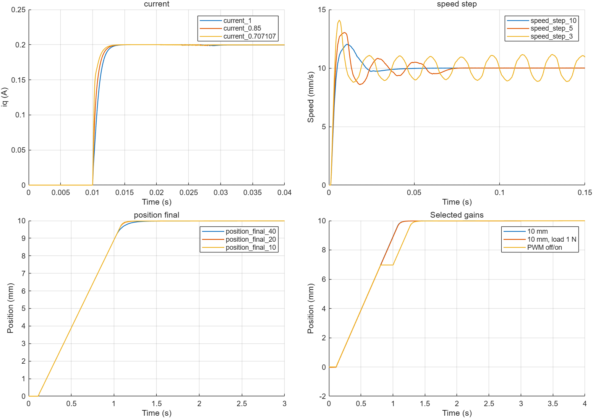

# 三闭环参数整定（2026-09-08）

本次只整定 `PMLSM_ThreeLoop_Simple` 的参数，不改变三环内部算式、计数器、布局、电机、死区逆变器或 PWM 半周期延迟。观测仍仅保留原定的 13 个信号。

## 原始依据与单位

原项目确实有速度环整定：`run_AUM3S4_speed_PI_h_compare_ideal_linear.m` 及 `run_AUM3S4_speed_PI_h_compare_dsp_iir_alpha01.m` 比较过 h=3/5/10。前者是理想速度反馈，后者包含差分测速和 IIR 延迟；本模型只有直接的电机速度反馈。本次保留 h 参数族的整定思路，重新计算时不计入已删除的测速滤波延迟。

电机当前参数：Rs=2.37 Ω，Ld=Lq=1.745 mH，质量 M=0.91 kg，推力常数 Kf=31.4/√2 N/Apeak。速度单位为 mm/s，因此机械通道增益为 `Kv=1000*Kf/M`。电流、速度、位置周期分别为 100 μs、1 ms、10 ms。

## 可重复的计算

`design_PMLSM_three_loop.m` 根据电机参数、控制周期和三个设计参数计算增益：

```matlab
Kp_ACR = L/(4*xi^2*Ts_ACR);
Ki_ACR = Kp_ACR*Rs/L;
omega_i = Kp_ACR/L;
Kaw_d = min(0.2,Ts_ACR*Rs/L); % Kaw_q 相同

Kv = 1000*Kf/M;
Tsum_v = 1/omega_i + Ts_ACR/2 + Ts_ASR;
Ti_v = h*Tsum_v;
Kp_ASR = (h+1)/(2*h*Tsum_v*Kv);
Ki_ASR = Kp_ASR/Ti_v;
Kaw_s = min(0.2,Ts_ASR/Ti_v);

omega_v_nominal = Kp_ASR*Kv;
Kp_pos = min(omega_v_nominal/separation,0.25/Ts_POS);
```

`Tsum_v` 是保守的速度环等效小时间常数预算：电流闭环近似时间常数、PWM 半拍延迟及一个速度周期。它不是精确辨识得到的传递函数。位置 P 根据内环响应速度选择，并限制 `Kp_pos*Ts_POS<=0.25`。所述频率是设计用近似量，不是包含死区、限幅和复位逻辑后的实测带宽。

积分块继续使用物理单位 `Ki*Ts`；抗饱和支路使用无量纲离散回算系数 Kaw。当前电机 Ld=Lq，所以 d/q 轴使用同一组 PI。

## 候选与取舍

最终设计参数为 `xi=1/sqrt(2)`、`h=10`、`separation=20`：

| 参数 | 整定前 | 整定后 |
|---|---:|---:|
| 电流 Kp | 4.3625 | 8.725 |
| 电流 Ki | 5925 | 11850 |
| 速度 Kp | 0.03 | 0.0180334748527 |
| 速度 Ki | 0.05 | 1.44267798821 |
| 位置 Kp | 5 | 22 |
| 电流 Kaw（d/q） | 0.2 | 0.135816618911 |
| 速度 Kaw | 0.4 | 0.08 |

近似设计频率依次为 795.8 Hz、70.0 Hz、3.50 Hz。电流限幅 0.3 A、速度积分限幅 0.1 A、位置速度参考限幅 10 mm/s 和位置死区 0.02 mm 保持不变。

- 电流环比较 xi=1、0.85、1/√2；使用完整模型和 0.2 A 电流指令，在 10 ms 时使能 PWM。xi=1/√2 的 90% 响应时间约 1.05 ms，进入 ±0.004 A 带约 2.15 ms，峰值约 0.200176 A。
- 速度环比较 h=10、5、3。正常 50 mm/s² 斜坡下都能跟踪；诊断阶跃中 h=3 有持续振荡，h=5 超调更大，选 h=10。10 mm/s 诊断阶跃峰值约 12.034 mm/s，进入 ±0.2 mm/s 带约 32.45 ms。诊断阶跃仅通过临时覆盖去掉斜坡；模型默认斜坡仍保留。
- 位置环比较 separation=40、20、10，对应 h=10 时 Kp=11、22、25 s⁻¹。选择 22 s⁻¹，兼顾末端响应与周期裕量。

## 零参考积分复位

仅改变增益时，原 `abs(v_ref)<0.2` 积分清零条件会反复丢掉维持负载需要的积分。1 N 负载下，末段最大位置误差约 0.0590 mm，未通过预设的 ±0.05 mm 检查。

本次将 `v_ref_zero_eps` 整定为 0。原比较条件为严格小于，故普通零参考不再清积分；没有删除模块或添加停止保持功能。1 N 对比中末段误差降至约 0.0200 mm。PWM 关闭、主动 PI 复位、外环关闭和电流测试模式对应的原硬复位仍保留。超速复位阈值也保留。

## 验证范围

候选数据及完整信号保存在 `docs/three_loop_tuning/*.json`、`*.mat`。未通过的候选和旧阈值带载结果一并保留，不通过放宽误差阈值来宣称通过。

最终检查包括正反向位置、1 mm 小行程、1 N/2 N 负载、带载速度、PWM 关闭再开启、正负/小电流和 d 轴电流，以及保持增益不变时质量增加 20%、电感减小 20%。这些是离散平均逆变器仿真，不是实机或开关级验证。位置原有 0.02 mm 死区保持，不能宣称零定位误差。

`tools/tune_three_loop.m` 使用 SimulationInput 临时覆盖进行候选测试，正常记录接口不增加内部调试日志。旧 `validate_three_loop.m` 和 `validate_enable_logic.m` 依赖此前日志接口，本次整定使用新的 13 信号验证路径。

## 最终候选验证结果

下表误差为仿真末段的最大绝对跟踪误差；位置用 mm，速度用 mm/s，电流用 A。12 项均按预设误差带通过。

| 场景 | 误差 | 允许误差 | 通过 |
|---|---:|---:|---|
| position_1mm | 0.009343859 | 0.05 | True |
| position_10mm | 0.01439948 | 0.05 | True |
| position_minus10mm | 0.01439948 | 0.05 | True |
| position_load_1N | 0.02000019 | 0.05 | True |
| speed_load_1N | 4.576324E-05 | 0.2 | True |
| pwm_restart | 0.0103776 | 0.05 | True |
| negative_current | 0.0002989783 | 0.004 | True |
| small_current | 0.0005016551 | 0.002 | True |
| d_current | 1.501577E-14 | 0.004 | True |
| mass_plus20pct | 0.01537094 | 0.05 | True |
| inductance_minus20pct | 0.01287262 | 0.05 | True |
| position_load_2N | 0.02 | 0.05 | True |

10 mm 默认定位在指令施加后约 1.079 s 进入 ±0.05 mm 误差带，3 s 时位置约 9.98811 mm。1 N 与 2 N 恒载时末段误差约 0.0200 mm。PWM 关闭区间的 ud/uq 还进行了严格为零检查。

候选与响应曲线：

## 独立目录验证

将模型、初始化脚本、整定函数和验证脚本复制到独立目录，并在新 MATLAB R2026a Update 5 进程中运行。依赖检查通过；默认 10 mm 与 2 N 负载两项复测通过，结果与候选验证一致。详见 `three_loop_tuning/isolated_tuning_validation.json`。
